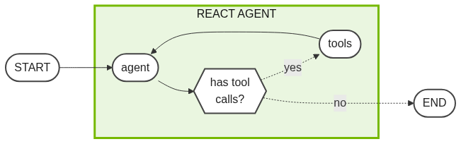
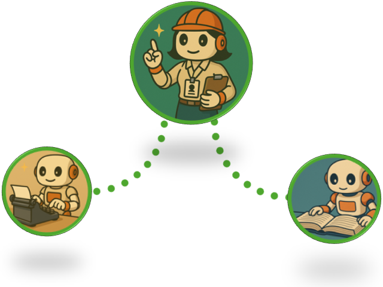

# Learn the Code

Want to make this agent your own? Let's dive into the code!
There are a few components in this agent, but we can break them down, one at a time.

Ready to get started? Let's start off by building the smallest components until we have everything we need.

<!-- fold:break -->

## Agentic Tools

### Tools Module

To build an agent, you first need to define its tools.
Tools are functions that let the agent take actions.

Your agent can either write text or use these tools.

We will define our tools in a single Python module:
<button onclick="openOrCreateFileInJupyterLab('code/docgen_agent/tools.py');"><i class="fa-brands fa-python"></i> code/docgen_agent/tools.py</button>.

<!-- fold:break -->

### Tavily Tool

For now, our agent just needs one tool: Tavily search.
You can find it in
<button onclick="goToLineAndSelect('code/docgen_agent/tools.py', 'def search_tavily');"><i class="fas fa-code"></i> search_tavily</button>.

This function is well documented using a [Google style docstring](https://google.github.io/styleguide/pyguide.html#383-functions-and-methods). Adding this docstring helps the agent understand how the tool should be used.

You can add more tools to this file later if needed.

<!-- fold:break -->

## Topic Research Agent

### Research Agent Architeture

Now that our tools are defined, we can create a simple agent to research a topic.

One of the simplest architectures for tool calling is called ReAct, short for Reasoning + Action.

In this setup, the agent thinks about what to do, takes an action, and then decides what to do next based on the result. This loop continues until no more actions are needed.

<!-- fold:break -->

### Research Agent Implementation

This architecture has been implemented for basic research in
<button onclick="openOrCreateFileInJupyterLab('code/docgen_agent/researcher.py');"><i class="fa-brands fa-python"></i> code/docgen_agent/researcher.py</button> and is represented in this diagram.

<!-- fold:break -->

### Researcher Agent Code Walkthrough

The agent's state definition is called
<button onclick="goToLineAndSelect('code/docgen_agent/researcher.py', 'class ResearcherState');"><i class="fas fa-code"></i> ResearcherState</button>.

The `state` object is passed to each node in the graph.

Each node in the graph manipulates the state using a function:
- **agent:** <button onclick="goToLineAndSelect('code/docgen_agent/researcher.py', 'def call_model');"><i class="fas fa-code"></i> call_model</button>
- **tools:** <button onclick="goToLineAndSelect('code/docgen_agent/researcher.py', 'def tool_node');"><i class="fas fa-code"></i> tool_node</button>
- **has tool calls?:** <button onclick="goToLineAndSelect('code/docgen_agent/researcher.py', 'def has_tool_calls');"><i class="fas fa-code"></i> has_tool_calls</button>

The graph is built and saved to
<button onclick="goToLineAndSelect('code/docgen_agent/researcher.py', 'graph =');"><i class="fas fa-code"></i> graph</button>.

If you would like to experiment with this agent, a
<button onclick="openOrCreateFileInJupyterLab('code/researcher_client.ipynb');"><i class="fa-solid fa-flask"></i> Researcher Agent Client</button> playground is available.

<!-- fold:break -->

## Section Author Agent

Simple ReAct agents are very powerful, but are often times combined with additional steps to do more complicated workflows.

The Section Author agent will need to perform additional research, but only when requested. Once the necessary research is available, it must use that research to write the section.

<!-- fold:break -->

### Author Agent Implementation

Notice the architecture below. A gating function has been added before the ReAct style agent. An additional step has also been added after the ReAct agent to do the writing.

This has been created in
<button onclick="openOrCreateFileInJupyterLab('code/docgen_agent/author.py');"><i class="fa-brands fa-python"></i> code/docgen_agent/author.py</button>.

<!-- fold:break -->

### Author Agent Code Walkthrough

The agent's state definition is called
<button onclick="goToLineAndSelect('code/docgen_agent/author.py', 'class SectionWriterState');"><i class="fas fa-code"></i> SectionWriterState</button>.
Each node in the graph manipulates the state.

The following nodes will be used in this agent:
- **needs research?:** <button onclick="goToLineAndSelect('code/docgen_agent/author.py', 'def needs_research');"><i class="fas fa-code"></i> needs_research</button>
- **agent:** <button onclick="goToLineAndSelect('code/docgen_agent/author.py', 'def research_model');"><i class="fas fa-code"></i> research_model</button>
- **tools:** <button onclick="goToLineAndSelect('code/docgen_agent/author.py', 'def tool_node');"><i class="fas fa-code"></i> tool_node</button>
- **has tool calls?:** <button onclick="goToLineAndSelect('code/docgen_agent/author.py', 'def has_tool_calls');"><i class="fas fa-code"></i> has_tool_calls</button>
- **writer:** <button onclick="goToLineAndSelect('code/docgen_agent/author.py', 'def writing_model');"><i class="fas fa-code"></i> writing_model</button>

The graph is built and saved to
<button onclick="goToLineAndSelect('code/docgen_agent/author.py', 'graph =');"><i class="fas fa-code"></i> graph</button>.

<!-- fold:break -->

### Author Agent Client

If you would like to directly interact with this agent, an
<button onclick="openOrCreateFileInJupyterLab('code/author_client.ipynb');"><i class="fa-solid fa-flask"></i> Author Agent Client</button> playground is available.

<!-- fold:break -->

## Document Generation Agent

Using these two agents, we can now put together our Document Generation Agent's workflow.

The Document Generation agent is actually the simplest yet, it is just a linear workflow!

We simply need to research the topic, plan the document outline, write the sections, and compile the whole report. Easy!

<!-- fold:break -->

### Agent Implementation

This workflow is defined in
<button onclick="openOrCreateFileInJupyterLab('code/docgen_agent/agent.py');"><i class="fa-brands fa-python"></i> code/docgen_agent/agent.py</button>.

Compare to this diagram.

<!-- fold:break -->

### Agent Code Walkthrough

The agent's state definition is called
<button onclick="goToLineAndSelect('code/docgen_agent/agent.py', 'class AgentState');"><i class="fas fa-code"></i> AgentState</button>.
The `state` object is passed to each node in the graph.

Each node in the graph manipulates the state using a function:
- **researcher agent:** <button onclick="goToLineAndSelect('code/docgen_agent/agent.py', 'def topic_research');"><i class="fas fa-code"></i> topic_research</button>
- **report_planner:** <button onclick="goToLineAndSelect('code/docgen_agent/agent.py', 'def report_planner');"><i class="fas fa-code"></i> report_planner</button>
- **author_agent:** <button onclick="goToLineAndSelect('code/docgen_agent/agent.py', 'def section_author_orchestrator');"><i class="fas fa-code"></i> section_author_orchestrator</button>
- **report_author:** <button onclick="goToLineAndSelect('code/docgen_agent/agent.py', 'def report_author');"><i class="fas fa-code"></i> report_author</button>

The graph is built and saved to
<button onclick="goToLineAndSelect('code/docgen_agent/agent.py', 'graph =');"><i class="fas fa-code"></i> graph</button>.

If you would like to experiment with this agent, a
<button onclick="openOrCreateFileInJupyterLab('code/agent_client.ipynb');"><i class="fa-solid fa-flask"></i> Agent Client</button> playground is available.

<!-- fold:break -->

### Agent Client

If you would like to directly interact with this agent, an
<button onclick="openOrCreateFileInJupyterLab('code/agent_client.ipynb');"><i class="fa-solid fa-flask"></i> Agent Client</button> playground is available.

<!-- fold:break -->

## Prompts

There's one crucial ingredient we've been quietly ignoring: the system prompts.

Every time an AI model is used, a system prompt is provided to tell the model what to do.

All of these system prompts have been consolidated into
<button onclick="openOrCreateFileInJupyterLab('code/docgen_agent/prompts.py');"><i class="fa-brands fa-python"></i> code/docgen_agent/prompts.py</button>.

<!-- fold:break -->

## Success!

That is the entire code base for the document generation agent.

