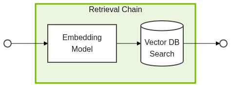
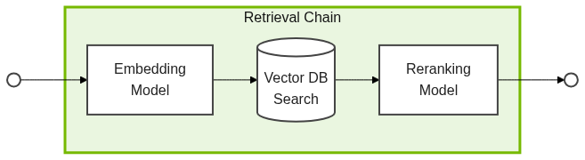

# Agentic Retrieval Augmented Generation


Let's build an IT Help Desk agent that can answer basic user queries by querying the Knowledge Base. A knowledge base has been provided at `./data/it-knowledge-base`. This directory contains markdown files documenting procedures for **Company LLC**.

<button onclick="openOrCreateFileInJupyterLab('code/rag_agent.py');"><i class="fa-brands fa-python"></i> code/rag_agent.py</button> is an initial layout for our agent's code. We will be using LangGraph's built-in classes to connect NVIDIA models and create our agent.

<!-- fold:break -->

## Agent Config and Setup

After the initial imports, our code starts by defining configuration and loading data sets.

<button onclick="goToLineAndSelect('code/rag_agent.py', '# Data Ingestion Configuration');"><i class="fas fa-code"></i> # Data Ingestion Configuration</button> defines the knowledge base path and the chunking parameters. More on those later.

<button onclick="goToLineAndSelect('code/rag_agent.py', '# Model Configuration');"><i class="fas fa-code"></i> # Model Configuration</button> specifies which models to use for each step.

Finally, <button onclick="goToLineAndSelect('code/rag_agent.py', '# Read the data');"><i class="fas fa-code"></i> # Read the data</button> reads the knowledge base markdown files.

<!-- fold:break -->

## Create a Vector Database

In production, the design of the database service and ingestion pipelines should be intentional. For now, we will take some shortcuts to get started quickly.
- We will use an in memory [FAISS](https://faiss.ai/index.html) database (pronounced *face*). This is an efficient way to spin up small databases quickly.
- We will focus on a simple text ingestion pipeline. Additional features, like multimodal support, should be considered before production.

To ingest the documents, we will **Chunk** the documents, **Embed** those chunks into vectors, and then **Insert** the vectors into the database.

<!-- fold:break -->

### Split documents into chunks

Document splitting is controlled by two things: chunk size and chunk overlap. We already defined these as `CHUNK_SIZE` and `CHUNK_OVERLAP`. The exact size and overlap should be tuned for production, but we are starting with good values.

Define <button onclick="goToLineAndSelect('code/rag_agent.py', 'splitter = ');"><i class="fas fa-code"></i> splitter</button> using these values and LangGraph's [`RecursiveCharacterTextSplitter`](https://python.langchain.com/docs/how_to/recursive_text_splitter/).

<details>
<summary>🆘 Need some help?</summary>

```
splitter = RecursiveCharacterTextSplitter(
    chunk_size=CHUNK_SIZE, chunk_overlap=CHUNK_OVERLAP
)
```

</details>

<!-- fold:break -->

### Embed chunks into vector representations

These chunks need to be embedded into vectors for the database. This is done with the `RETRIEVER_EMBEDDING_MODEL` defined before.

Use the [NVIDIAEmbeddings](https://build.nvidia.com/nvidia/llama-3_2-nv-embedqa-1b-v2?snippet_tab=LangChain) class to define <button onclick="goToLineAndSelect('code/rag_agent.py', 'embeddings = ');"><i class="fas fa-code"></i> embeddings</button>. The API Key has already been configured, it does not need to be specified. Set truncate to `END`.

<details>
<summary>🆘 Need some help?</summary>

```
embeddings = NVIDIAEmbeddings(
    model=RETRIEVER_EMBEDDING_MODEL,
    truncate="END"
)
```

</details>

<!-- fold:break -->

### Insert vectors into database

With our processed documents and embedding model, we can define <button onclick="goToLineAndSelect('code/rag_agent.py', 'vectordb = ');"><i class="fas fa-code"></i> vectordb</button>.

<!-- fold:break -->

## Create the Retrieval Chain

Now that we have our populated vector database, we can build a chain for content retrieval. For this, we will use components from [NVIDIA NeMo Retriever](https://developer.nvidia.com/nemo-retriever).

### Simple Retrieval

LangChain allows us to easily create a basic retrieval chain from our Vector Database object. This is used to define <button onclick="goToLineAndSelect('code/rag_agent.py', 'kb_retriever = ');"><i class="fas fa-code"></i> kb_retriever</button>. This chain will have the embedding step and the lookup step.

<center>



</center>

<!-- fold:break -->

### Reranking Model

NVIDIA offers a Reranker model to improve the relevance and order of retrieved documents. Use the [NVIDIARerank](https://build.nvidia.com/nvidia/llama-3_2-nv-rerankqa-1b-v2?snippet_tab=LangChain) class to define <button onclick="goToLineAndSelect('code/rag_agent.py', 'reranker = ');"><i class="fas fa-code"></i> reranker</button>.

<details>
<summary>🆘 Need some help?</summary>

```
reranker = NVIDIARerank(model=RETRIEVER_RERANK_MODEL)
```

</details>

<!-- fold:break -->

### Reranking retrieval chain and tool

LangChain’s <button onclick="goToLineAndSelect('code/rag_agent.py', '= ContextualCompressionRetriever');"><i class="fas fa-code"></i> ContextualCompressionRetriever</button> makes it easy to combine a retriever with additional steps that process its results. We use that to attach the Retrieval Chain to the Reranking Model.

<center>



</center>

We expose this enhanced retrieval pipeline as a tool for the agent using LangGraph’s <button onclick="goToLineAndSelect('code/rag_agent.py', '= create_retriever_tool');"><i class="fas fa-code"></i> create_retriever_tool</button>. The `name` and `description` fields help the agent decide when to use this tool during multi-step reasoning.

<!-- fold:break -->

## Create the Agent


With our vector database and retriever chain in place, we're ready to construct the agent graph. Think of this graph as a flowchart that maps out the possible steps the model can take to solve a task. In traditional, step-by-step LLM applications, these are called "chains." When the workflow involves more dynamic, non-linear decision-making, like with agents, we refer to them as "graphs."

<!-- fold:break -->

### Define the Model

Every agent uses an LLM for decision making and communicating. For this example, we will be using NVIDIA's Nemotron Nano model. These models represent a tuned balance of speed, cost, and accuracy. The LLM model name was defined in `LLM_MODEL`. Use this and the [ChatNVIDIA](https://python.langchain.com/docs/integrations/chat/nvidia_ai_endpoints/#instantiation) class to define <button onclick="goToLineAndSelect('code/rag_agent.py', 'llm =');"><i class="fas fa-code"></i> llm</button>.

<details>
<summary>🆘 Need some help?</summary>

```
llm = ChatNVIDIA(model=LLM_MODEL)
```

</details>

<!-- fold:break -->

### Define the System Prompt

<center>


</center>

A system prompt has been defined in the code. Feel free to review it at <button onclick="goToLineAndSelect('code/rag_agent.py', 'SYSTEM_PROMPT =');"><i class="fas fa-code"></i> SYSTEM_PROMPT</button>.

<!-- fold:break -->

### Create the Graph

Becuase the ReAct architecture is so common, LangGraph provides a function that will create ReAct agent graphs. Plug `llm`, `RETRIEVER_TOOL`, and `SYSTEM_PROMPT` into LangGraph's [`create_react_agent`](https://langchain-ai.github.io/langgraph/agents/agents/#2-create-an-agent). Assign the resulting value to <button onclick="goToLineAndSelect('code/rag_agent.py', 'AGENT =');"><i class="fas fa-code"></i> AGENT</button>.

<details>
<summary>🆘 Need some help?</summary>

```
AGENT = create_react_agent(
    model=llm,
    tools=[RETRIEVER_TOOL],
    prompt=SYSTEM_PROMPT,
)
```

</details>

<!-- fold:break -->

## Ready for Showtime!

<center>


</center>

Your IT Help Desk agent is fully built and ready for the big show! Continue [Running Your Agent](running.md) to watch it responding to user queries.
