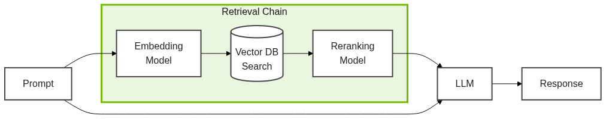
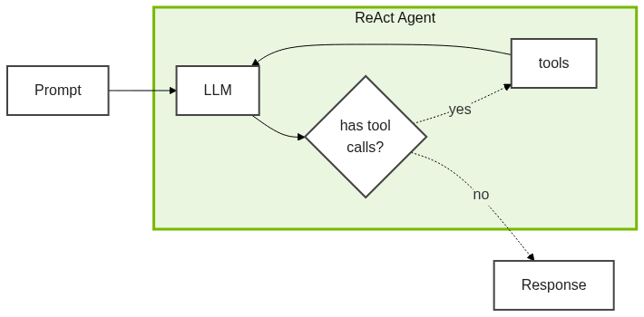

# Introduction to RAG

Retrieval Augmented Generation (RAG) is a powerful approach for working with unstructured data in LLM-powered applications. As the AI field evolves, RAG continues to see use, but its implementation is different. Agentic RAG provides flexibility, scalability, and accuracy that would not be practical with traditional RAG.

In this lesson, we will go over a brief history of LLM use and understand why agentic RAG is so important.

<!-- fold:break -->

## LLM Inference

The simplest method for interacting with LLMs is directly prompting them and allowing the model to provide a response. The architecture is simple, but you are limited to only what the model knew at training time.

<!-- fold:break -->

## LLM with RAG

Retrieval augmented generation (RAG) is a useful technique that improves accuracy of LLMs by providing them with additional context at inference time. Typically, this data is recalled from a custom Vector Database.

Unstructured documents can be indexed and saved into the Vector Database. They are then searched by context similarity with the prompt.

<!-- fold:break -->

## Upscale with Agents

RAG works well, but it has limits. The LLM can't control how data is retrieved or choose between different data sources. It always runs the same retrieval step, making it hard to scale or support multiple datasets.

Agentic RAG solves these problems by letting the model decide when and how to use retrieval as a tool. The model can choose to look up information only when it needs more context to answer a question.

<!-- fold:break -->

## ReAct Agent Architecture

ReAct Agents are a simple agentic architecture that add tool calling support to traditional LLMs. We will use this to build our RAG Agent.

The prompt is provided to the LLM. If the model requests any tool calls, those tools will be run, added to the chat history, and sent back to the model to be invoked again. When no tools are requested, the model's response is sent back.

<!-- fold:break -->

## Agentic RAG Architecture

To make a ReAct Agent do RAG, just give it the Retrieval Chain as a tool. The agent can then decide when and how to search for information.

You can also add more tools for different data sources if needed. This makes your architecture more flexible.

<!-- fold:break -->

## Let's Build One

Now that we have a basic understanding of RAG, ReAct Agents, and how to plumb them up, let's go build one of our own.

Continue to [Setting up Secrets](secrets.md) to get started!
