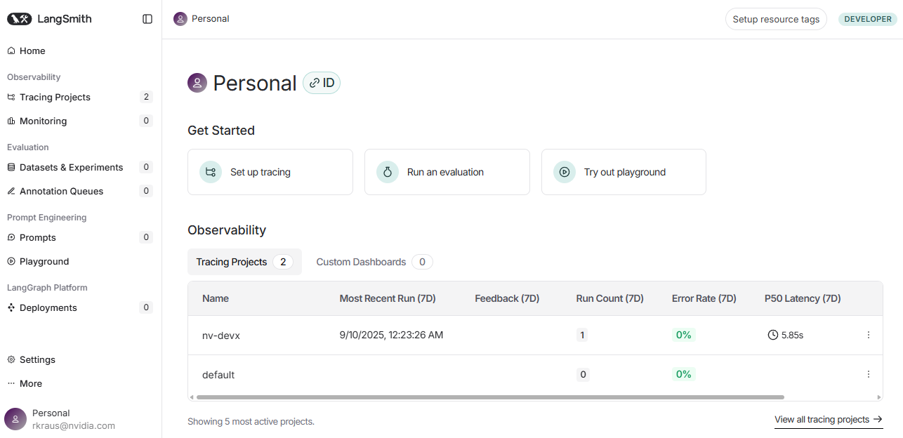
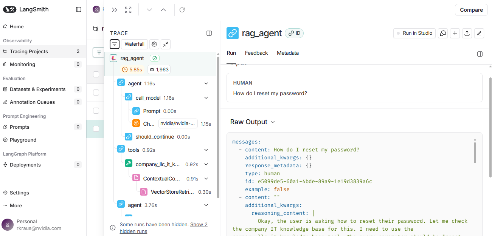
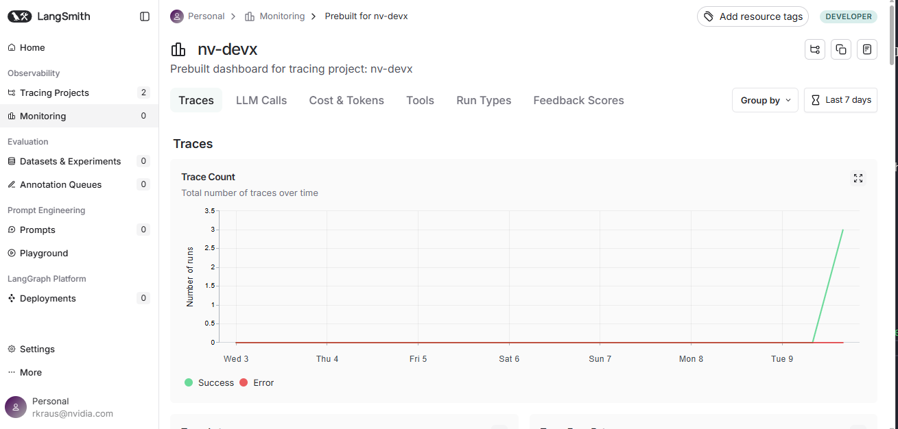

# Running Your Agent


We've done our part, its time to put this agent to work! In this excercise, we will start the agent and ask it a few questions. We will learn the tricks of the trade used by developers to test and debug agents.

<!-- fold:break -->

## Start the Server

LangGraph offers a convenient CLI that launches a web server to host your agent behind an API. This allows you to interact with your agent programmatically by sending user prompts and receiving responses.

While other frameworks may provide different ways to deploy agents, the core idea is the same: your agent runs as a service accessible via an API endpoint.

<!-- fold:break -->

### Launching the API Service

To get started, start a new <button onclick="openNewTerminal();"><i class="fas fa-terminal"></i> terminal</button> here in Jupyter.

Change to the `code` directory:

```bash
cd code
```

And start your Agent API with the LangGraph CLI.

```bash
langgraph dev
```

<!-- fold:break -->

### Examing the Log Output


If you see any errors while running your agent, they will appear in this terminal window. Carefully read the error messages to see what went wrong and where. Use them to debug your code. If you get stuck, revisit [Building Agentic RAG](agentic_rag.md) for guidance. Your agent will automatically reload as you make changes and save your code.

<details>
  <summary>See an example error</summary>

  The following is a snippet from a log that experienced an AttributeError while starting the agent.

  ```
  2025-09-09T04:33:07.173253Z [info     ] Reading knowledge base data from /project/data/it-knowledge-base [__rag_agent] api_variant=local_dev langgraph_api_version=0.4.11 thread_name=asyncio_0
  92%|█████████████████████████████████████████████████████████████████████████████████████████████████████████████████████████████████████████████▏           | 12/13 [00:00<00:00, 11963.79it/s]
  2025-09-09T04:33:07.179200Z [info     ] Ingesting 12 documents into FAISS vector database. [__rag_agent] api_variant=local_dev langgraph_api_version=0.4.11 thread_name=asyncio_0
  2025-09-09T04:33:07.179588Z [info     ] Shutting down remote graphs    [langgraph_api.graph] api_variant=local_dev langgraph_api_version=0.4.11 thread_name=MainThread
  2025-09-09T04:33:07.183624Z [error    ] Traceback (most recent call last):
    File "/home/workbench/.local/lib/python3.12/site-packages/starlette/routing.py", line 694, in lifespan
      async with self.lifespan_context(app) as maybe_state:
                ^^^^^^^^^^^^^^^^^^^^^^^^^^
    File "/usr/lib/python3.12/contextlib.py", line 210, in __aenter__
      return await anext(self.gen)
            ^^^^^^^^^^^^^^^^^^^^^
    File "/home/workbench/.local/lib/python3.12/site-packages/langgraph_runtime_inmem/lifespan.py", line 79, in lifespan
      await graph.collect_graphs_from_env(True)
    File "/home/workbench/.local/lib/python3.12/site-packages/langgraph_api/graph.py", line 421, in collect_graphs_from_env
      graph = await run_in_executor(None, _graph_from_spec, spec)
              ^^^^^^^^^^^^^^^^^^^^^^^^^^^^^^^^^^^^^^^^^^^^^^^^^^^
    File "/home/workbench/.local/lib/python3.12/site-packages/langgraph_api/utils/config.py", line 144, in run_in_executor
      return await asyncio.get_running_loop().run_in_executor(
            ^^^^^^^^^^^^^^^^^^^^^^^^^^^^^^^^^^^^^^^^^^^^^^^^^
    File "/usr/lib/python3.12/concurrent/futures/thread.py", line 59, in run
      result = self.fn(*self.args, **self.kwargs)
              ^^^^^^^^^^^^^^^^^^^^^^^^^^^^^^^^^^
    File "/home/workbench/.local/lib/python3.12/site-packages/langgraph_api/utils/config.py", line 135, in wrapper
      return func(*args, **kwargs)
            ^^^^^^^^^^^^^^^^^^^^^
    File "/home/workbench/.local/lib/python3.12/site-packages/langgraph_api/graph.py", line 468, in _graph_from_spec
      modspec.loader.exec_module(module)  # type: ignore[possibly-unbound-attribute]
      ^^^^^^^^^^^^^^^^^^^^^^^^^^^^^^^^^^
    File "<frozen importlib._bootstrap_external>", line 999, in exec_module
    File "<frozen importlib._bootstrap>", line 488, in _call_with_frames_removed
    File "/project/code/rag_agent.py", line 37, in <module>
      chunks = splitter.split_documents(docs)
              ^^^^^^^^^^^^^^^^^^^^^^^^
  AttributeError: 'ellipsis' object has no attribute 'split_documents'
  ```

</details>

<!-- fold:break -->

## Chat with the Agent

Let's spin up a chat client and see how our agent preforms. A simple Streamlit app has been included for chatting with agent, <button onclick="launch('Simple Agents Client');"><i class="fa-solid fa-rocket"></i> Simple Agents Client</button>.

In the sidebar, ensure the `rag_agent` client is selected and try chatting! If you aren't sure what to ask, try asking:

```
How do I reset my password?
```

Try out a few follow up questions, see what kind of answer you get.

<!-- fold:break -->

## Agent Observability

> **NOTE:** This step will only work if you configured the `LANGSMITH_API_KEY` during the [Setting up Secrets](secrets.md) step.


As your agents become more sophisticated, managing their internal complexity becomes a struggle.

Tracing helps visualize each step your agent takes. This makes it much easier to debug and optimize your agent's behavior.

Monitoring tracks long term trends of your agent. This helps ensure quality of service while also helping developers balance costs, latency, and complexity.

Because we are using LangGraph to build our agent, [LangSmith](https://www.langchain.com/langsmith) is a good choice for observability as it is automatically integrated and requires no code changes.

<!-- fold:break -->

### Tracing

Log into the dashboard at [https://smith.langchain.com/](https://smith.langchain.com/). There should be a new tracing project available, `nv-devx`. Select it to see recorded traces.



<!-- fold:break -->

Every execution of an agent on our API server will be traced and reported here. Select any of the `rag_agent` entries to see one of these traces.



Notice how clicking on the steps reveals way more data than we return at the end of the graph!

<!-- fold:break -->

### Monitoring

The sidebar menu contains a link called `Monitoring`. Clicking on that results in a view broken out by tracing projects. Select `nv-devx` and browse the kinds of data that LangGraph reports. Custom dashboards and alerts are also supported.



<!-- fold:break -->

## Operations Ready

Our agent is now ready for day 2 operations. To control costs, we would like to run our own models before going to production. [Migrate to Local NIM](migrate.md).